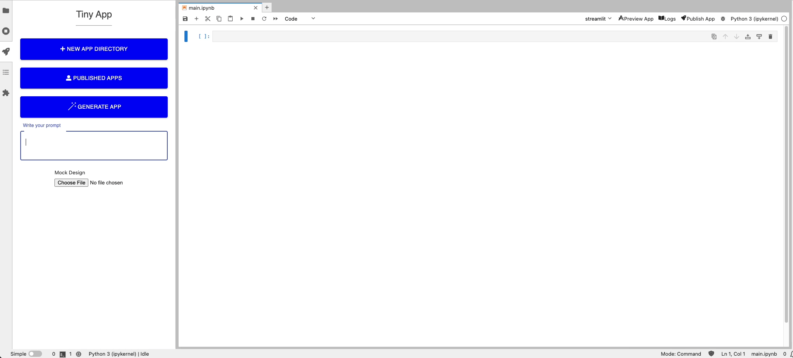

# jupyterlab-tinyapp

This extension allows you to develop, preview, and deploy TinyApp from JupyterLab.

Describe your app in natural language to let LLM model generate code and requirements.txt:



## Install

To install the extension, execute:

```bash
pip install jupyterlab_tinyapp
```

#### Environment variables

| Environment Variable            | Default                       | Description |
|---------------------------------|-------------------------------|-------------|
| APP_PREVIEW_PORT                | 8002                          | app preview port. Ignored if APP_PREVIEW_HOST is set |
| APP_PREVIEW_HOST                | http://127.0.0.1:{APP_PREVIEW_PORT} | hostname for app preview url |
| APP_PREVIEW_BASE_URL            | /tinyapp/app-preview          | base url for app preview |
| TINY_APP_SERVER_URL             | (REQUIRED)                    | url for tinyapp server |
| CONDA_ENV_DIR                   | /opt/conda                    | path to conda env under which app preview process is run |
| VALIDATE_SSL                    | true                          | validate ssl if set to true |
| TINY_APP_IMAGE                  |                               | image for app publish |
| VOLUME_CLAIM_NAME               | (REQUIRED)                    | k8s volume claim containing main file for app publish |
| VOLUME_CLAIM_SUB_PATH           |                               | subpath within volume claim |
| VOLUME_CLAIM_MOUNT_PATH         | (REQUIRED)                    | mount path of volume claim to app container |
| AI_ENABLED                      | true                          | enable app code generation using LLM |
| OPENAI_API_KEY                  | (REQUIRED if AI_ENABLED set)  | api key to connect to openai LLM model |
| MOCK_AI_STREAM                  | false                         | mock ai response |

## User guide

See [User Guide](./docs/USER_GUIDE.md)

## Contributing

#### Development install

To develop the extension locally, first set the required environment variables in terminal, then follow:

```bash
# Activate your conda env (you can follow this tutorial: https://jupyterlab.readthedocs.io/en/stable/extension/extension_tutorial.html)
conda activate jupyterlab-ext

# Install package in development mode
pip install -e "."
# Link your development version of the extension with JupyterLab
jupyter labextension develop . --overwrite
# Server extension must be manually installed in develop mode
jupyter server extension enable jupyterlab_tinyapp
# Rebuild extension Typescript source after making changes
jlpm build
```

You can watch the source directory and run JupyterLab at the same time in different terminals to watch for changes in the extension's source and automatically rebuild the extension.

```bash
# Watch the source directory in one terminal, automatically rebuilding when needed
jlpm watch
# Run JupyterLab in another terminal
jupyter lab
```

With the watch command running, every saved change will immediately be built locally and available in your running JupyterLab. Refresh JupyterLab to load the change in your browser (you may need to wait several seconds for the extension to be rebuilt).

By default, the `jlpm build` command generates the source maps for this extension to make it easier to debug using the browser dev tools. To also generate source maps for the JupyterLab core extensions, you can run the following command:

```bash
jupyter lab build --minimize=False
```

#### Development uninstall

```bash
# Server extension must be manually disabled in develop mode
jupyter server extension disable jupyterlab_tinyapp
pip uninstall jupyterlab_tinyapp
```

In development mode, you will also need to remove the symlink created by `jupyter labextension develop`
command. To find its location, you can run `jupyter labextension list` to figure out where the `labextensions`
folder is located. Then you can remove the symlink named `jupyterlab_tinyapp` within that folder.

#### Releasing the extension

Once a new release is created in GitHub, GitHub Action will be triggered that automatically packages and push the new version to PyPi.
