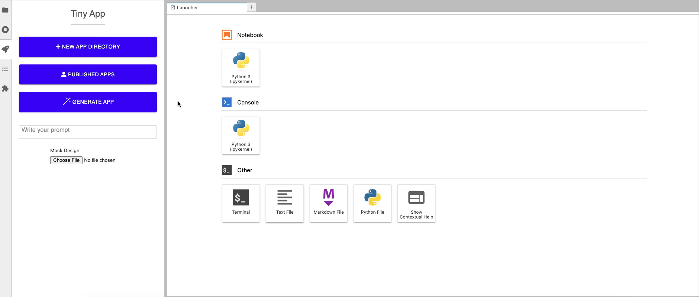
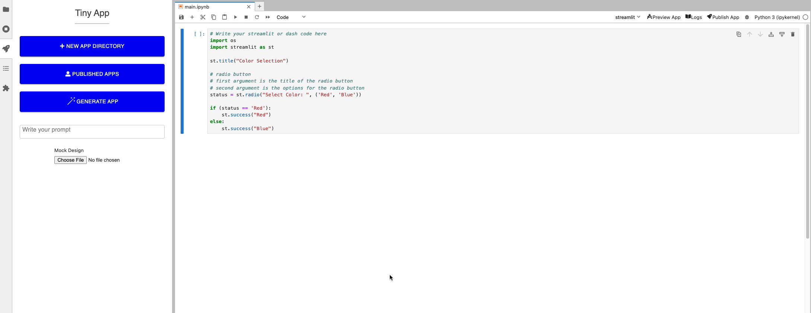
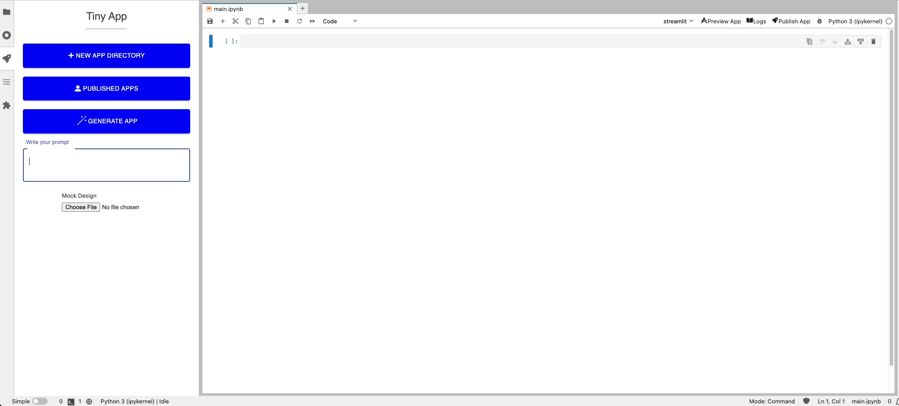
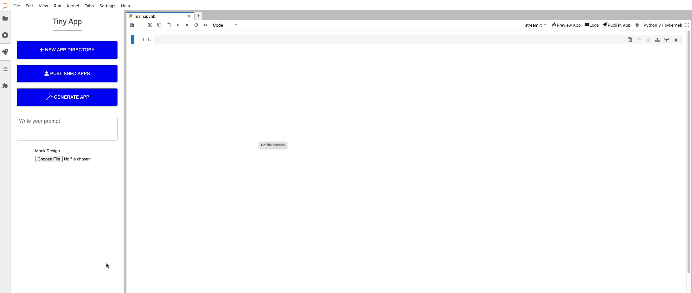

# TinyApp Extension User Guide

## App Preview

App preview runs an app process within the same Docker container (or local machine) where you're running this extension.

## Deploy App

Once finished with testing your app, you can now publish it as a standalone deployment.

## Generate App with AI

You can generate an app from natural language description.

Generate app from an image:

Continusouly chat with the model to update & iterate on your app.