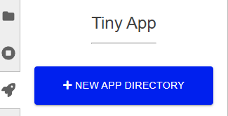
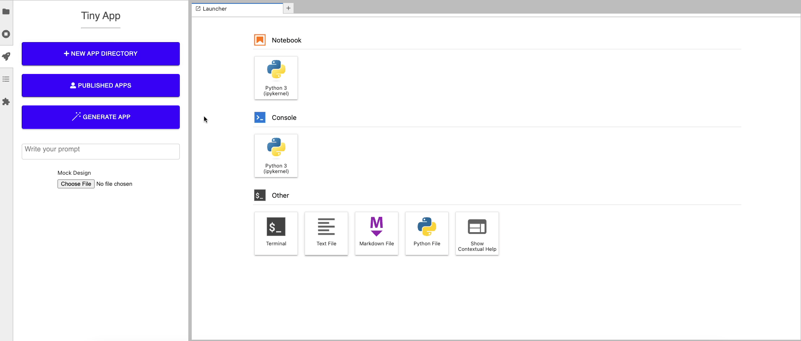
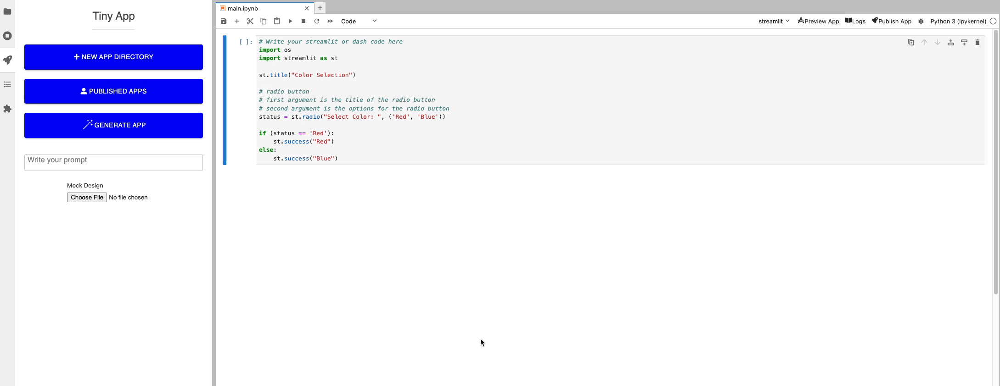
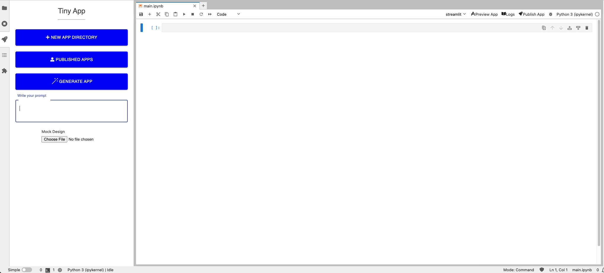
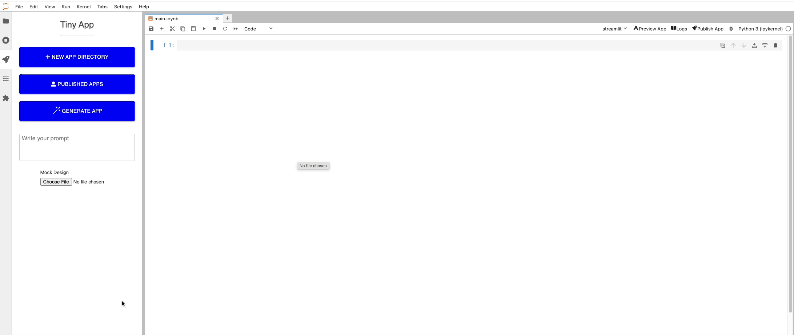

# TinyApp Extension User Guide

## App Directory

To get started, create app directory.

## App Preview

App preview runs an app process within the same Docker container (or local machine) where you're running this extension.

## Deploy App

Once finished with testing your app, you can now publish it as a standalone deployment.

## Generate App with AI

You can generate an app from natural language description.

Generate app from an image:

Continusouly chat with the model to update & iterate on your app.

Note: When generating, choose the Action below the Generate button to explicitly select whether you want to create a new app or modify the currently open notebook. If you choose "Create new app" while the notebook already has code, the request will be rejected. Likewise, choosing "Modify existing app" requires existing code in the notebook.